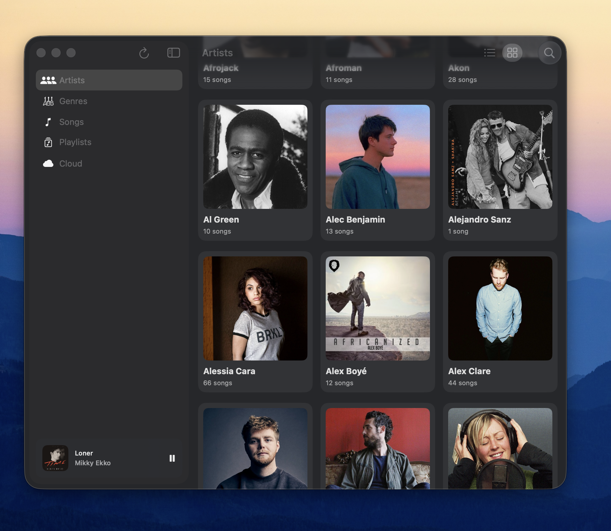
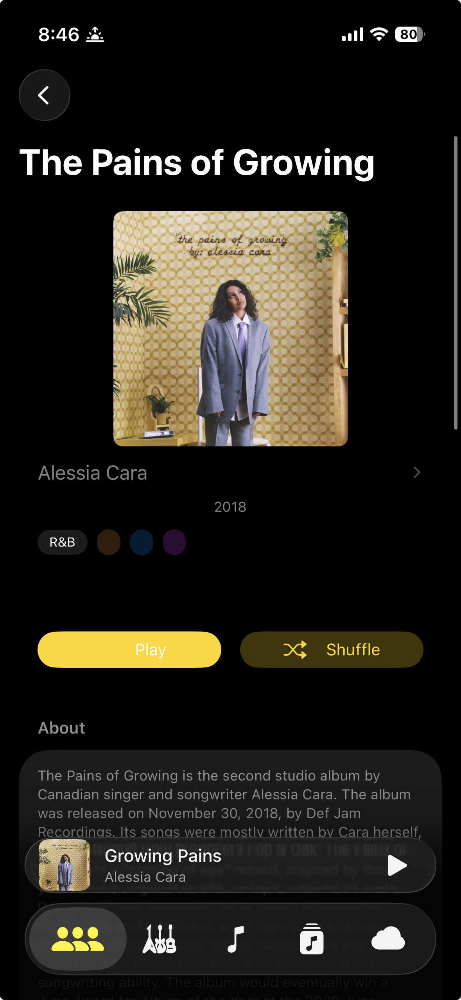
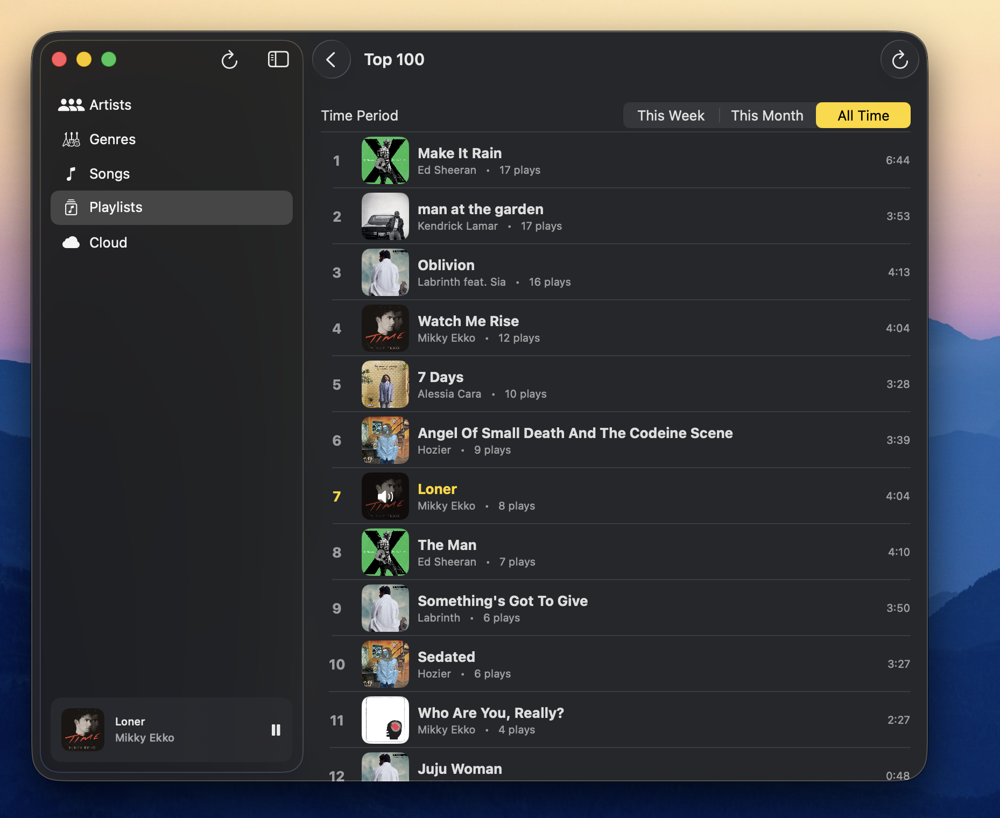
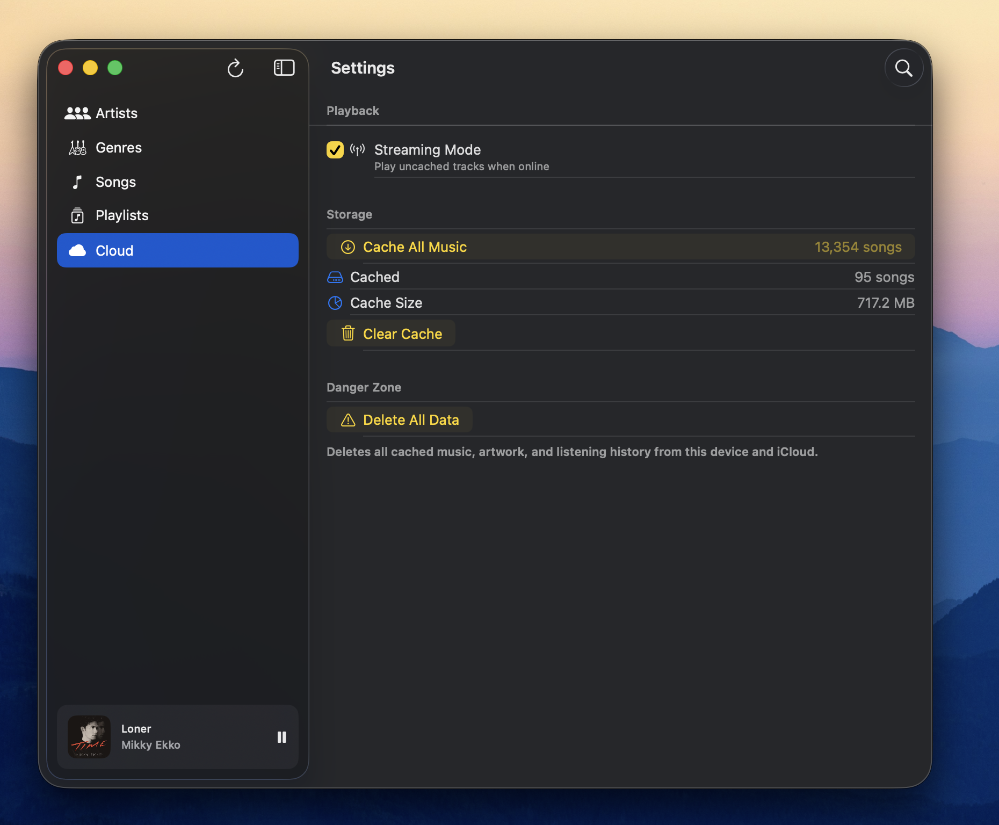
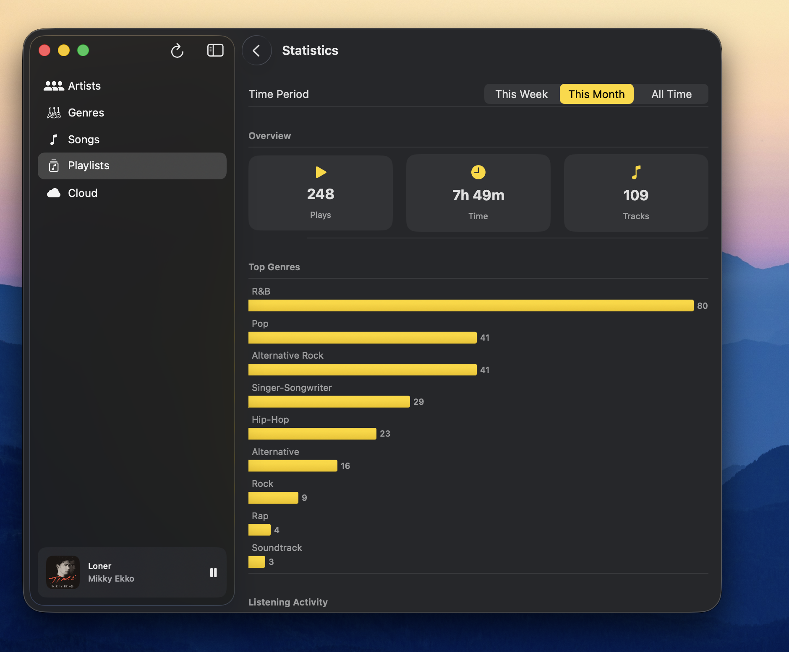

# Music



A unified Swift music app for iOS and macOS with native upload capabilities. Host your own music library on S3-compatible storage and enjoy seamless offline playback across all your Apple devices.


## Features

### Playback
- Play, pause, skip forward/backward with smooth transitions
- Repeat modes: off, repeat all, repeat one
- Queue management with up next display
- Seekable progress bar with time display
- Background audio playback continues when app is minimized
- System Now Playing integration (lock screen, Control Center, headphone controls)

### Smart Shuffle
Intelligent shuffle that learns your listening habits:
- **Artist diversity**: Avoids same artist back-to-back (spreads across last 5 tracks)
- **Album spread**: Prevents clustering of tracks from the same album
- **Session memory**: Won't repeat tracks you've already heard this session
- **Rediscovery**: Boosts tracks you haven't played in 30+ days
- **Genre continuity**: Prefers similar genres for smooth transitions
- **Mood matching**: Favors tracks with matching mood
- **Skip learning**: Reduces weight for frequently skipped tracks
- **Completion tracking**: Penalizes tracks you often don't finish
- **Time-of-day patterns**: Learns what you listen to at different times

### Browsing & Discovery
- **Home View** (iOS): Curated landing screen with Top Tracks, Recently Added, and genre chips
- **Artists View**: Browse all artists with grid or list layout toggle
- **Albums View**: Browse all albums with grid or list layout toggle
- **Songs View**: Full track listing with cache status indicators
- **Genres View**: Browse by genre with drill-down to matching tracks
- **Radio Mode**: Start radio from track, genre, mood, or favorite artists
- **Auto-Playlists**: Top 100 tracks by play count, Recently Added
- Artist detail pages with bio, albums, and track listings
- Album detail pages with artwork, track listing, and metadata

### Offline & Caching
- Download entire library for fully offline playback
- Per-track download progress with cancel option
- Cascading artwork caching (automatically downloads artist and album images)
- Cache size display and one-tap clear option
- Offline mode banner shows last catalog update time
- Cached tracks indicated with visual status icons
- Non-cached tracks appear dimmed and disabled

### Search
- Global search across artists, albums, and songs
- Real-time results as you type

### Statistics & Analytics
- Play count tracking per track
- CloudKit sync for statistics across devices
- Listening time and unique tracks played
- Top Artists chart with play counts
- Top Genres chart with listening breakdown
- Time period filters: week, month, all time

### Cross-Device Sync
- Upload music on macOS and it becomes available on iOS within seconds
- Catalog syncs automatically via CDN and iCloud Key-Value storage
- No manual configuration needed on iOS after initial macOS setup

### Native Upload (macOS)
- Built-in upload interface in the macOS app
- Automatic metadata enrichment from TheAudioDB, MusicBrainz, and Last.fm
- FLAC to M4A conversion via ffmpeg
- Parallel uploads with progress tracking
- Credentials stored securely in macOS Keychain

### Platform-Specific
- **iOS**: HomeView as primary landing screen, 5-tab navigation (Home, Songs, Artists, Playlists, Radio), iOS 18 tab bar mini-player, iOS 26 Liquid Glass design
- **macOS**: NavigationSplitView with three-column layout, sidebar player, dedicated Upload and Settings tabs
- View mode preferences (grid/list) persist via `@AppStorage`

## Prerequisites

- **Xcode 15+** (for building the app)
- **ffmpeg** (for audio conversion during upload)
- **S3-compatible storage** (DigitalOcean Spaces, AWS S3, MinIO, etc.)
- **Optional API keys**: TheAudioDB (free), MusicBrainz contact email, Last.fm

### Installing ffmpeg

```bash
# macOS (Homebrew)
brew install ffmpeg
```

## Getting Started

### macOS Setup (Upload)

1. **Build and run the macOS app**
   ```bash
   open frontend/Music.xcodeproj
   # Select "My Mac" as destination and press Cmd+R
   ```

2. **Configure upload settings**
   - Open the Upload tab in the sidebar
   - Enter your DigitalOcean Spaces credentials:
     - Access Key
     - Secret Key
     - Bucket name
     - Region (e.g., sfo3, nyc3)
     - Prefix (e.g., music)
   - Optionally add API keys for metadata enrichment

3. **Organize your music**
   ```
   music/
   ├── Artist Name/
   │   ├── Album Name/
   │   │   ├── 01 - Track.mp3
   │   │   ├── 02 - Track.flac
   │   │   └── ...
   ```

4. **Upload your library**
   - Click "Select Folder" and choose your music directory
   - Preview detected files (shows new vs existing)
   - Click "Start Upload"
   - The catalog is automatically uploaded to CDN and synced to iCloud

### iOS Setup

1. **Build and run the iOS app**
   ```bash
   open frontend/Music.xcodeproj
   # Select an iOS Simulator or device and press Cmd+R
   ```

2. **Catalog syncs automatically**
   - Once you've uploaded music from macOS, iOS will detect the CDN settings via iCloud
   - The catalog loads automatically on app launch
   - Pull to refresh or return to the app to sync updates

### Manual CDN Configuration (Optional)

If iCloud sync isn't working or you want to use a different catalog:

1. Open Settings in the iOS app
2. Enter the CDN Prefix (e.g., `music`)
3. The app will fetch the catalog from the configured CDN

## Build Commands

```bash
# Build for iOS Simulator
xcodebuild -project frontend/Music.xcodeproj -scheme Music \
  -destination 'platform=iOS Simulator,name=iPhone 16' build

# Build for macOS
xcodebuild -project frontend/Music.xcodeproj -scheme Music \
  -destination 'platform=macOS' build

# Run tests
xcodebuild -project frontend/Music.xcodeproj -scheme Music \
  -destination 'platform=iOS Simulator,name=iPhone 16' test
```

## Project Structure

```
Music/
├── frontend/
│   └── Music/
│       ├── Models/
│       │   ├── CatalogModels.swift       # SwiftData: CatalogArtist, CatalogAlbum, CatalogTrack
│       │   ├── MusicCatalog.swift        # Codable DTOs for JSON
│       │   └── CacheModels.swift         # SwiftData: CachedTrack, CachedArtwork
│       ├── Services/
│       │   ├── MusicService.swift        # Catalog loading and CDN fetch
│       │   ├── PlayerService.swift       # AVPlayer and Now Playing
│       │   ├── CacheService.swift        # Track/artwork downloading
│       │   ├── ShuffleService.swift      # Weighted random selection
│       │   ├── AnalyticsStore.swift      # Core Data + CloudKit analytics
│       │   └── Upload/                   # macOS-only upload services
│       │       ├── MusicUploader.swift           # Main orchestrator
│       │       ├── UploadConfiguration.swift     # Keychain storage
│       │       ├── StorageService.swift          # S3 client
│       │       ├── MetadataExtractor.swift       # AVFoundation tags
│       │       ├── ArtworkExtractor.swift        # Embedded artwork
│       │       ├── AudioConverter.swift          # ffmpeg conversion
│       │       ├── CatalogBuilder.swift          # JSON generation
│       │       ├── MusicBrainzService.swift      # MBID lookups
│       │       ├── TheAudioDBService.swift       # Artist/album metadata
│       │       └── LastFMService.swift           # Fallback metadata
│       └── Views/
│           ├── ContentView.swift                 # TabView / NavigationSplitView
│           ├── HomeView.swift                    # iOS home screen (curated sections)
│           ├── ArtistsView.swift
│           ├── AlbumsView.swift
│           ├── SongsView.swift
│           ├── RadioView.swift                   # Radio mode
│           ├── NowPlayingSheet.swift
│           ├── SettingsView.swift
│           └── UploadView.swift                  # macOS-only
├── screenshots/
└── CLAUDE.md
```

## API Integrations

These services are called natively from Swift during the upload process:

| Service | Purpose | Rate Limit |
|---------|---------|------------|
| **TheAudioDB** | Artist bios, images, album metadata | Free tier available |
| **MusicBrainz** | Accurate MBIDs for lookups | 1 req/sec (contact email improves limits) |
| **Last.fm** | Fallback album artwork and wiki | API key required |

## Catalog JSON Structure

The macOS app generates a `catalog.json` file with this structure:

```json
{
  "artists": [
    {
      "name": "Artist Name",
      "bio": "Artist biography...",
      "image_url": "https://cdn.example.com/artist.jpg",
      "genre": "Alternative Rock",
      "style": "Rock/Pop",
      "mood": "Happy",
      "albums": [
        {
          "name": "Album Name",
          "image_url": "https://cdn.example.com/album.jpg",
          "release_date": 2020,
          "genre": "Pop-Rock",
          "tracks": [
            {
              "title": "Track Title",
              "artist": "Artist Name",
              "album": "Album Name",
              "track_number": 1,
              "duration": 245,
              "format": "m4a",
              "url": "https://cdn.example.com/music/Artist/Album/Track.m4a",
              "s3_key": "Artist/Album/Track.m4a",
              "genre": "Pop-Rock",
              "mood": "Relaxed"
            }
          ]
        }
      ]
    }
  ]
}
```

## Screenshots

| iOS | macOS |
|-----|-------|
|  |  |





## Contributing

1. Fork the repository
2. Create a feature branch (`git checkout -b feature/amazing-feature`)
3. Commit your changes (`git commit -m 'Add amazing feature'`)
4. Push to the branch (`git push origin feature/amazing-feature`)
5. Open a Pull Request

## License

This project is licensed under the MIT License - see the [LICENSE](LICENSE) file for details.

## Acknowledgments

- [TheAudioDB](https://www.theaudiodb.com/) for artist and album metadata
- [MusicBrainz](https://musicbrainz.org/) for accurate music identification
- [Last.fm](https://www.last.fm/) for fallback metadata
